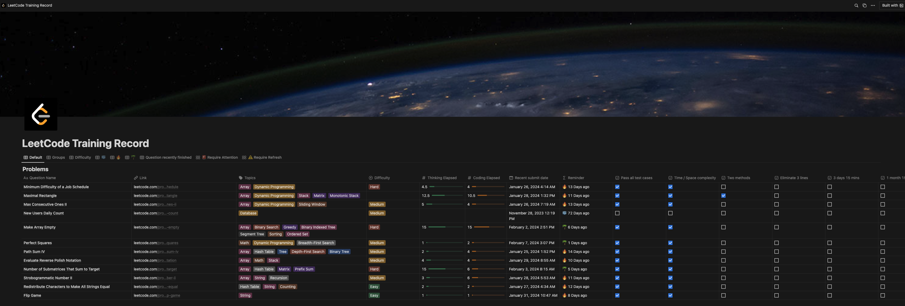

## LeetCode Notion Practice Recording Tool
This reporitory can be used to sync the change between leetcode and notion for better measuring the leetcode practice quality. There are two components to use this tool:

1. Leetcode practice notion template which the instruction from [interview science](https://interview-science.org/).
2. The synchroization script, which is necessarily the repo you are checking. By running this script, you can automatically synchroize your recent submission to a notion tracking board which can reflect.

## Preview

**Preview website**: [site](https://small-dragon.notion.site/LeetCode-Training-Record-7bd7f84b52af4bbc8224307598f2b870?pvs=4)

## Quick Start

### Create a notion page with database
Create the page by duplicate this [template](https://small-dragon.notion.site/LeetCode-Training-Record-7bd7f84b52af4bbc8224307598f2b870?pvs=4).

### Install dependencies
Use the following command to create a miniconda environment.

```
conda env create -f environment.yml
```

### Credential Setup
Please fill out the following part in `constants.py`
```python
# Get the next two values from your browser cookies
LEETCODE_SESSION = "your leetcode session"

CSRF_TOKEN = "your csrf token"

NOTION_TOKEN = "your notion token"

DATABASE_ID = "database id"
```

- Leetcode session and CSRF token can be found in network request after you sign into leetcode.
- Notion token could be created in [my-integration](https://www.notion.so/my-integrations)
- Database ID could be found by following this [instruction](https://developers.notion.com/reference/retrieve-a-database).


### Synchroization
By running the following command, your recent submission will be used to update the notion database.

Generally I would recommend set up a Cron job on your laptop. And run the following command.

```shell
python main.py --update_with_submission --n 100
```

### More fine grained metrics(only python supported)
By adding the following section to your submission, more detailed will reflect on your page.

```python
'''
[
    {
        "Time Complexity": "O()",
        "Space Complexity": "O()",
        "Thinking Time": 0,
        "Coding Time": 0,
        "Solutions": "",
        "Use Hint": false,
        "Use Solution": false
    }
]

class Solution:
    ...
'''
```

## Acknowledgement

This reporitory uses [leetcode client](https://github.com/fspv/python-leetcode) as the client to pull leetcode submission and other operations. I added some new APIs to make it work.

This reporitory uses [notion sdk](https://github.com/ramnes/notion-sdk-py) as the client to update notion.